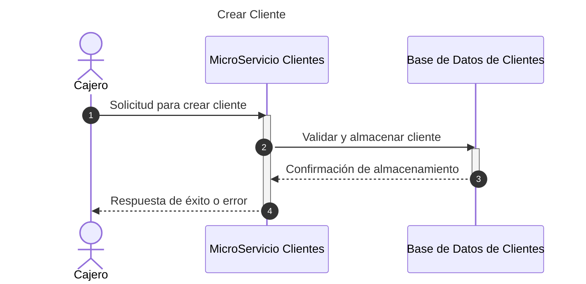
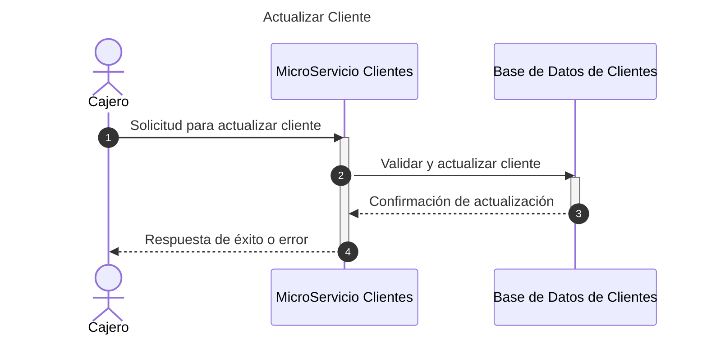
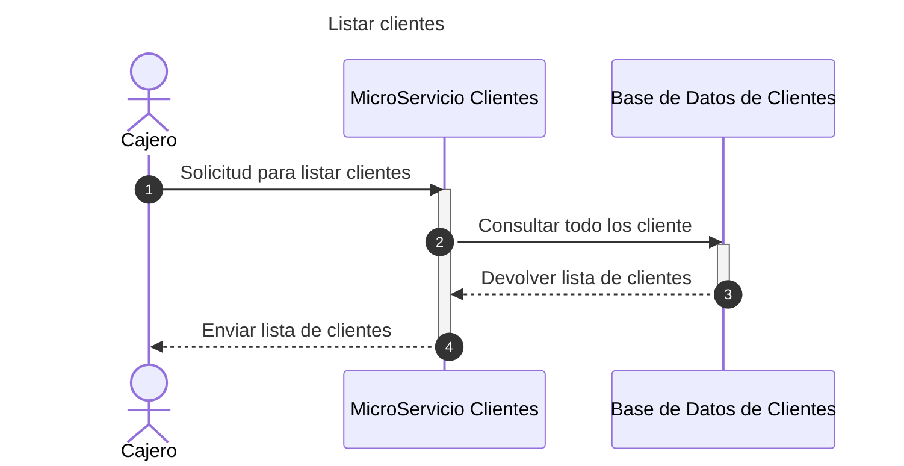
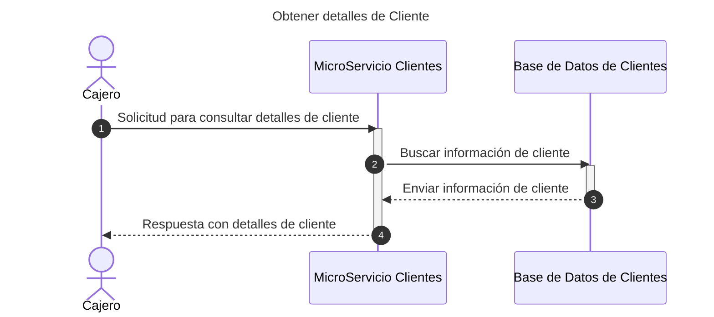
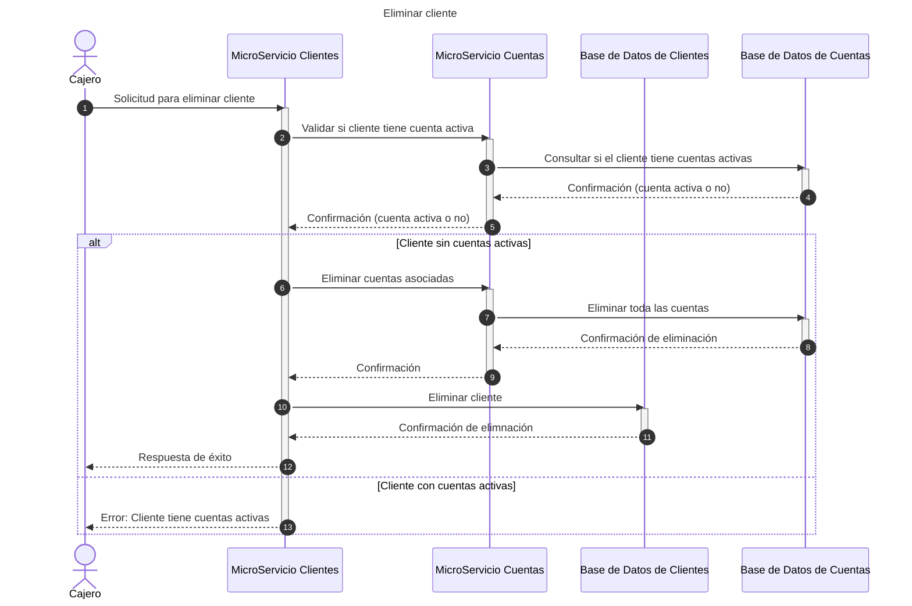
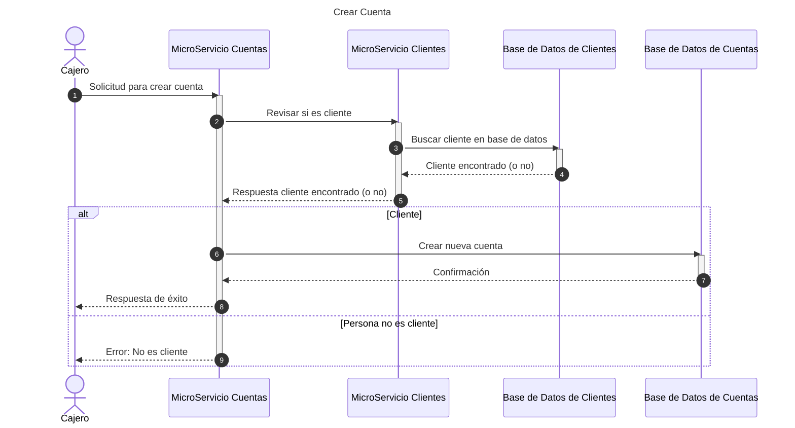
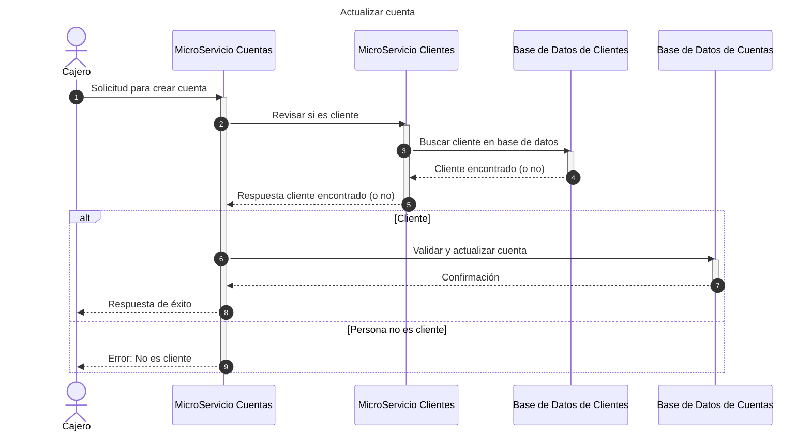
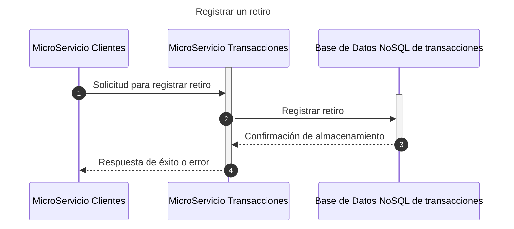
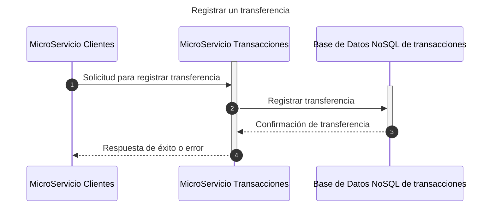
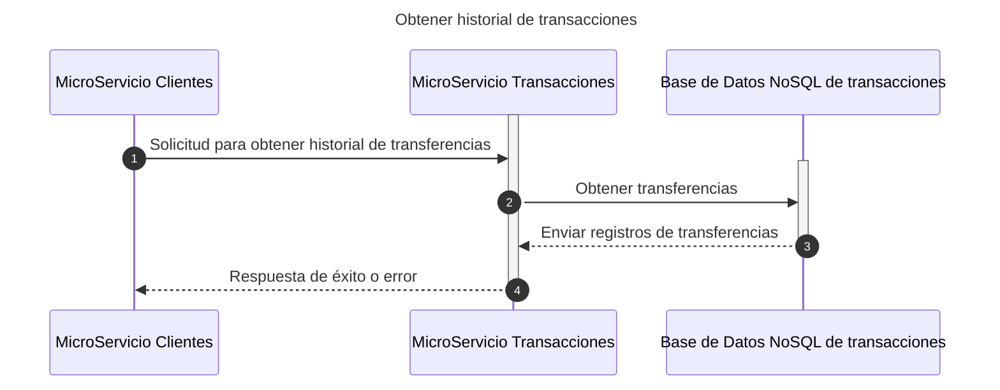

# Diagramas de secuencia

## Cliente

### Crear Cliente



### Actualizar Cliente



### Listar clientes



### Detalles de Cliente



### Eliminar Cliente



## Cuentas

### Crear cuenta



### Actualizar cuenta



### Listar cuentas

```mermaid
sequenceDiagram
    title Listar cuentas
    autonumber
    actor C as Cajero
    participant MsCuenta as MicroServicio Cuentas
    participant CuentaDb as Base de Datos de Cuentas
    C ->> MsCuenta: Solicitud para listar cuentas
    activate MsCuenta
    MsCuenta ->> CuentaDb: Consultar todas las cuentas
    activate CuentaDb
    CuentaDb -->> MsCuenta: Devolver lista de cuentas
    deactivate CuentaDb
    MsCuenta -->> C: Enviar lista de cuentas
    deactivate MsCuenta
 ```

### Obtener detalle de cuenta

```mermaid
sequenceDiagram
    title Obtener detalles de Cuenta
    autonumber
    actor C as Cajero
    participant MsCuenta as MicroServicio Cuentas
    participant CuentaDb as Base de Datos de Cuentas
    C ->> MsCuenta: Solicitud para consultar detalle de cuentas
    activate MsCuenta
    MsCuenta ->> CuentaDb: Consultar todas las cuentas
    activate CuentaDb
    CuentaDb -->> MsCuenta: Enviar información de cuenta
    deactivate CuentaDb
    MsCuenta -->> C: Respuesta con detalle de cuenta
    deactivate MsCuenta
 ```

### Borrar cuenta

```mermaid
sequenceDiagram
    title Borrar cuenta
    autonumber
    actor C as Cajero
    participant MsCuenta as MicroServicio Cuentas
    participant CuentaDb as Base de Datos de Cuentas
    C ->> MsCuenta: Solicitud para borrar cuenta
    activate MsCuenta
    MsCuenta ->> CuentaDb: Obtener saldo actual
    activate CuentaDb
    CuentaDb -->> MsCuenta: Enviar saldo actual
    deactivate CuentaDb

    alt Saldo en 0
        MsCuenta ->> CuentaDb: Solicitar eliminación de cuenta
        activate CuentaDb
        CuentaDb -->> MsCuenta: Confirmación de eliminación exitosa
        deactivate CuentaDb
        MsCuenta -->> C: Confirmación: Cuenta eliminada exitosamente
    else Saldo es negativo
        MsCuenta -->> C: Error: Cuenta sobregirada (Realizar pago antes de eliminar)
    else Saldo positivo
        MsCuenta -->> C: Error: Retirar saldo restantes antes de eliminar
        deactivate MsCuenta
    end
 ```

### Depositar

```mermaid
sequenceDiagram
    title Hacer depósito en Cuenta
    autonumber
    actor C as Cajero
    participant MsCuenta as MicroServicio Cuentas
    participant CuentaDb as Base de Datos de Cuentas
    participant MsTransaction as Microservicio Transacciones
    C ->> MsCuenta: Solicitud para hacer depósito
    activate MsCuenta
    MsCuenta ->> CuentaDb: Verificar existencia de la cuenta
    activate CuentaDb
    CuentaDb -->> MsCuenta: Cuenta valida
    deactivate CuentaDb
    MsCuenta ->> CuentaDb: Actualizar saldo con monto depósitado
    activate CuentaDb
    CuentaDb -->> MsCuenta: Confirmación de saldo actualizado
    deactivate CuentaDb
    activate MsTransaction
    MsCuenta ->> MsTransaction: Registrar transacción
    MsTransaction -->> MsCuenta: Confirmación de registro
    deactivate MsTransaction
    MsCuenta ->> C: Depósito realizado
    deactivate MsCuenta
 ```

### Retirar

```mermaid
sequenceDiagram
    title Hacer Retiro en Cuenta
    autonumber
    actor C as Cajero
    participant MsCuenta as MicroServicio Cuentas
    participant CuentaDb as Base de Datos de Cuentas
    participant MsTransaction as Microservicio Transacciones
    C ->> MsCuenta: Solicitud para hacer retiro
    activate MsCuenta
    MsCuenta ->> CuentaDb: Obtener saldo actual
    activate CuentaDb
    CuentaDb -->> MsCuenta: Enviar saldo actual
    deactivate CuentaDb

    alt Saldo en adecuado
        MsCuenta ->> CuentaDb: Actualizar saldo con monto retirado
        activate CuentaDb
        CuentaDb -->> MsCuenta: Confirmación de saldo actualizado
        deactivate CuentaDb
        activate MsTransaction
        MsCuenta ->> MsTransaction: Registrar transacción
        MsTransaction -->> MsCuenta: Confirmación de registro
        deactivate MsTransaction
        MsCuenta -->> C: Confirmación: Retiro realizado exitosamente
    else Saldo en insuficiente: -500 (corriente) o 0 (ahorro)
        MsCuenta -->> C: Error: Saldo insuficiente
        deactivate MsCuenta
    end
 ```

### Transferir de una cuenta otra

```mermaid
sequenceDiagram
    title Hacer Transferencia de una cuenta a otra
    autonumber
    actor C as Cajero
    participant MsCuenta as MicroServicio Cuentas
    participant CuentaDb as Base de Datos de Cuentas
    participant MsTransaction as Microservicio Transacciones
    C ->> MsCuenta: Solicitud para hacer transferencia
    activate MsCuenta
    MsCuenta ->> CuentaDb: Solicitar información de las cuentas
    activate CuentaDb
    CuentaDb -->> MsCuenta: Enviar información de cuentas
    deactivate CuentaDb

    alt Saldo en adecuado y cuentas validas
        MsCuenta ->> CuentaDb: Actualizar saldos de cuentas
        activate CuentaDb
        CuentaDb -->> MsCuenta: Confirmación de saldos actualizados
        deactivate CuentaDb
        activate MsTransaction
        MsCuenta ->> MsTransaction: Registrar transacción
        MsTransaction -->> MsCuenta: Confirmación de registro
        deactivate MsTransaction
        MsCuenta -->> C: Confirmación: Transacción realizada exitosamente
    else Saldo en insuficiente: -500 (corriente) o 0 (ahorro)
        MsCuenta -->> C: Error: Saldo insuficiente
        deactivate MsCuenta
    end
 ```

## Transacciones

### Registrar un depósito

```mermaid
sequenceDiagram
    title Registrar un depósito
    autonumber
    participant MsCliente as MicroServicio Clientes
    participant MsTransaction as MicroServicio Transacciones
    participant TransactionDb as Base de Datos NoSQL de transacciones
    activate MsTransaction
    MsCliente ->> MsTransaction: Solicitud para registrar depósito
    activate TransactionDb
    MsTransaction ->> TransactionDb: Registrar depósito
    TransactionDb -->> MsTransaction: Confirmación de almacenamiento
    deactivate TransactionDb
    MsTransaction -->> MsCliente: Respuesta de éxito o error
    deactivate MsTransaction
```

### Registrar un retiro



### Registrar una transferencia


### Obtener historial de transacciones



