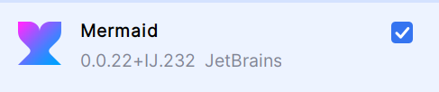

# Transaction MS

Parte de la aplicación XYZ Bank:

# XYZ Bank - Danny Vera

Este sistema gestiona transacciones bancarias entre cuentas de clientes, permitiendo la creación de clientes, cuentas, y realizar transacciones (retiros y depósitos). El proyecto está compuesto por microservicios independientes que se comunican entre sí. La documentación se realiza con OpenAPI y se incluyen diagramas para ilustrar la arquitectura.

## Documentación y Diagramas

- [Diagrama de Uso](Documentacion%2FDiagramaDeUso.md)
- [Diagramas de Secuencia](Documentacion%2FDiagramaDeSecuencia.md)
- [Diagrama de Componentes](Documentacion%2FDiagramaDeComponente.md)
- [Documentación OpenAPI](Documentacion%2Fswagger.md)
- [TestCoverage con Jacoco](Documentacion%2FTestCoverage.md)
> **Nota**: Para visualizar los diagramas de secuencia, descarga el siguiente plugin:  

## Microservicios

- **Gateway**: Punto de entrada a los microservicios  
  - URL: [http://localhost:8080/](http://localhost:8080/)

- **Registry Service**: Registro y localización de microservicios  
  - URL: [http://localhost:8761/](http://localhost:8761/)

- **CustomerMS**: CRUD de información de clientes  
  - URL: [http://localhost:8081/customer](http://localhost:8081/customer)

- **AccountMS**: CRUD de cuentas bancarias, con funcionalidades de depósitos y retiros  
  - URL: [http://localhost:8082/account](http://localhost:8082/account)

- **AccountMS**: Registra los operaciones de deposito, retiro y transferencias que se ejecutan desde el accountMS
    - URL: [http://localhost:8083/transaction](http://localhost:8083/transaction)

## Base de Datos

- **H2 Database**: Base de datos relacional en memoria para pruebas usado para los servicios AccountMS y CustomerMS
- **MongoDB**: Base de datos no relacional usado para registrar las operaciones bancarias entre cuentas
> [!IMPORTANT]  
> Tener instalado mongo para utilizar el sevicio transactions
## Reglas de Negocio

1. **Validaciones de Cliente:**
   - Cada cliente debe tener un DNI único.
   - No se puede eliminar un cliente si tiene cuentas activas.

2. **Validaciones de Cuentas Bancarias:**
   - El saldo inicial debe ser mayor a 0.
   - No se permiten retiros que dejen saldo negativo en cuentas de ahorro.
   - Las cuentas corrientes permiten un sobregiro de hasta -500.

## Instrucciones

1. Levantar los servicios: ***Registry, Gateway, TransactionMs, AccountMS y CustomerMS***.
   - AccountMS: [http://localhost:8080/account](http://localhost:8080/account)
   - CustomerMS: [http://localhost:8080/customer](http://localhost:8080/customer)
   - TransactionMS: [http://localhost:8080/customer](http://localhost:8080/transaction)
   - Eureka: [http://localhost:8080/eureka/main](http://localhost:8080/eureka/main)

2. Importar las [colecciones](Documentacion%2FNTT%20DATA%20BANK.postman_collection.json) en Postman.

3. Probar los endpoints.

> **Acceso a la Base de Datos H2**  
> - Customer DB: [http://localhost:8080/customer-h2-console](http://localhost:8080/customer-h2-console)  
> - Account DB: [http://localhost:8080/account-h2-console](http://localhost:8080/account-h2-console)  
> 
> **Conexión H2:**  
> - JDBC URL: `jdbc:h2:mem:customerdb`  
> - JDBC URL: `jdbc:h2:mem:accountdb`  
> - Usuario: `SA`  
> - Contraseña: `password`
